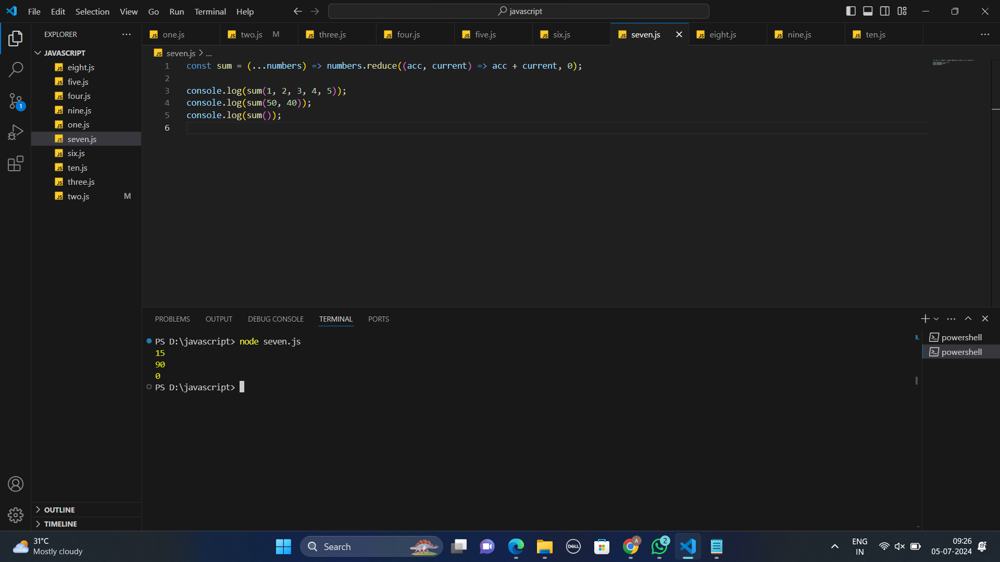
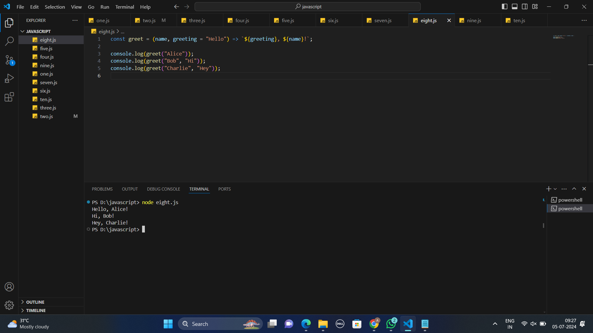

# ES6 Javascript Assignment

## One
```
let age=30;
const name="Alice";
 name="bob";
 console.log(name)

```
## Output

## Two
```
const add=(a,b)=>{
    console.log(a+b) ;
}
add(9,11);


```
## Output


## Three
```
let name="Alice";
let age=30;
let txt=`Hello,${name} Your age is ${age}.`;
console.log(txt);

```
## Output


## Four
```
const person={
    firstName: "Alice", 
    lastName: "Johnson"
}
const{firstName,lastName}=person;
console.log(firstName);
console.log(lastName)

```
## Output


## Five
```
const numbers = [1, 2, 3, 4, 5];

const [first, second] = numbers;

console.log(first);  
console.log(second);

```
## Output


## Six
```
const arr1 = [1, 2, 3];
const arr2 = [4, 5, 6];

const combined = [...arr1, ...arr2];

console.log(combined);

```
## Output


## Seven
```
const sum = (...numbers) => numbers.reduce((acc, current) => acc + current, 0);

console.log(sum(1, 2, 3, 4, 5)); 
console.log(sum(50, 40));        
console.log(sum());

```
## Output



## Eight
```
const greet = (name, greeting = "Hello") => `${greeting}, ${name}!`;

console.log(greet("Alice"));          
console.log(greet("Bob", "Hi"));      
console.log(greet("Charlie", "Hey"));

```
## Output


## Nine
```

class Animal {
    constructor(name) {
      this.name = name;
    }
  }
  
  class Dog extends Animal {
    bark() {
      return `Woof! My name is ${this.name}`;
    }
  }
  
  const myDog = new Dog('Julie');
  console.log(myDog.bark());


```
## Output


## Ten
```
const waitAndReturn = () => 
    new Promise(resolve => setTimeout(() => resolve("Done"), 2000));
  
  async function run() {
    const result = await waitAndReturn();
    console.log(result); 
  }
  
  run();

```
## Output

